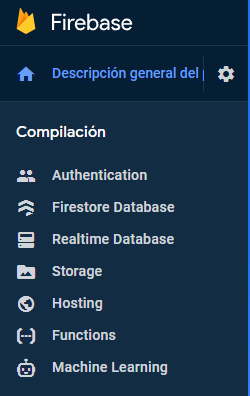

# AutenticacionFirebase

## Crear Proyecto en Firebase

1. Accedemos a la consola de Firebase con nuestro email de google: [Consola_Firebase](https://console.firebase.google.com/).
2. Agregamos un proyecto.
3. Click en "Authentication" en el menu lateral.
4. Click en Comenzar.
5. En "Agrega tu primer método de acceso y comienza a utilizar Firebase Auth" agregamos "Correo electrónico/contraseña" (lo habilitamos).
6. Volvemos a la pagina principal del proyecto (click en "Descripción general del proyecto") y agregamos Firebase a nuestra app (click en simbolo WEB).
7. Nombramos nuestra app y click en "Registrar".


## Instalación de firebase

En la consola de nuestro ordenador y en la carpeta de nuestro proyecto:

`npm install firebase --save`

Cambiamos la versión de Firebase en package.json: 

```
"dependencies": {
   
    "firebase": "^8.10.0"
    
  }
  ```
  
  Reinstalamos las dependencias:
  
  `npm install`
  
  En la carpeta enviroments creamos el archivo firebase.ts con la configuración de nuestro proyecto Firebase. Esta información se encuentra en el icono ⚙️ al lado de "Descripción general del proyecto" > "configuración del proyecto".
  
  
 <p align="center">
  
</p>
  
  
  ```
  export const firebaseConfig = {
  
    apiKey: "XXXXXXXXXXXXXXXXXXXX",
    authDomain: "xxxxxxxxxxxxx.firebaseapp.com",
    projectId: "xxxxxxxxxxxxxxxxx",
    messagingSenderId: "xxxxxxxxxx",
    appId: "xxxxxxxxxxxxxxxxxxxxxxxxxxxxx",
    measurementId: "xxxxxxxxxxxxxxxx"
    
 };
 ```

Estas claves son privadas. Añadir a gitignore antes de subir a github.


